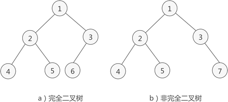
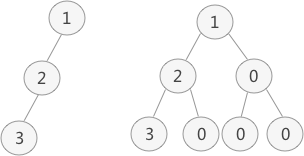
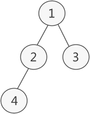

## 树的介绍

### 树的定义
树就像一个族谱，也像一串葡萄。

递归定义：
1. 有且只有一个根节点
2. 有若干个互不相交的子树，这些子树本身也是一棵树

### 树的结点

叶子结点：如果结点没有任何子结点，那么此结点称为叶子结点。

### 结点的度和层次

对于一个结点，拥有的子树数（节点有多少分支）称为结点的**度**。子节点的个数称为度。

结点的层次：一棵树的深度（高度）是树中结点所在的最大层次。深度：从根节点到最底层节点的层数称之为深度，根节点是第一层。

### 叶子节点

没有子节点的节点

### 有序树和无序树

如果树中结点的子树从左到右看，谁在左边，谁在右边，是有规定的，这棵树称为`有序树`，反之称为`无序树`。

> 在有序树中，一个结点最左边的子树称为 **第一个孩子**，最右边的称为 **最后一个孩子**。

### 一般树

任意一个节点的子节点的个数都不受限制。

### 森林

由 m（m>=0）个互不相交的树组成的集合被称为森林。


### 二叉树

满足两个条件的树就是二叉树：

- 本身是有序树
- 树中包含的各个节点的度不能超过2，即只能是0、1或者2.

#### 分类

1. 一般二叉树
2. 满二叉树
	定义：在不增加层数的情况下，无法再添加一个节点的二叉树
3. 完全二叉树
	满二叉树是完全二叉树的一个特例

### 二叉树的性质

1. 二叉树中，第i层最多有$2^{i-1}$
2. 深度为k的满二叉树必有$2^k-1$个节点，叶子数为$2^{k-1}$
3. 满二叉树中不存在度为1的节点，每一个分支点中都有两棵深度相同的子树，且叶子节点都在最底层。
4. 具有n个节点的满二叉树的深度为${log_{2}}^{n+1}$

## 完全二叉树



定义：如果二叉树中除去最后一层节点为满二叉树，且最后一层的结点依次从左到右分布，则此二叉树被称为完全二叉树。

完全二叉树除了具有普通二叉树的性质，它自身也具有一些独特的性质，比如说，n 个结点的完全二叉树的深度为 $\left \lfloor {log_{2}}^{n} \right \rfloor$+1

> $\left \lfloor {log_{2}}^{n} \right \rfloor$ 表示取小于 ${log_{2}}^{n}$ 的最大整数。例如，$\left \lfloor {log_{2}}^{4} \right \rfloor$ = 2，而 $\left \lfloor {log_{2}}^{5} \right \rfloor$ 结果也是 2。 向下取整。

对于任意一个完全二叉树来说，如果将含有的结点按照层次从左到右依次标号（如图 3a)），对于任意一个结点 i ，完全二叉树还有以下几个结论成立：

1. 当 i>1 时，父亲结点为结点 [i/2] 。（i=1 时，表示的是根结点，无父亲结点）
2. 如果 2*i>n（总结点的个数） ，则结点 i 肯定没有左孩子（为叶子结点）；否则其左孩子是结点 2*i 。
3. 如果 2*i+1>n ，则结点 i 肯定没有右孩子；否则右孩子是结点 2*i+1 。
 
## 树的存储

### 遍历方式

如果用数组存储的话，不能只存储有效节点，不然不能用下面的遍历方式反推出原来的排列

1. 先序遍历
2. 中序遍历
3. 后序遍历

### 二叉树的顺序存储结构

优点：
	查找某个节点的父节点和子节点（也包括判断有没有子节点）很方便
缺点：
	耗用内存很大

二叉树的顺序存储，指的是使用`顺序表（数组）`存储二叉树。需要注意的是，顺序存储只适用于完全二叉树。因此，如果我们想顺序存储普通的二叉树，需要提前将普通二叉树转化为完全二叉树。


图1

普通二叉树转完全二叉树的方法很简单，只需给二叉树额外添加一些节点，将其拼凑成完全二叉树即可。

上图中，左侧是普通二叉树，右侧是转化后的完成（满）二叉树。

完全二叉树的顺序存储，仅需从根节点开始，按照层次依次将树中节点存储到数组即可。


图2

如上图2在数组中的存储状态为下图：


图3 完全二叉树存储状态示意图

同样，图1中的存储结构为图4:


图4 普通二叉树的存储状态

> 从顺序表中还原完全二叉树也很简单，根据完全二叉树的性质，将树中的节点按照层次并从左到右依次标号，若节点i有左右孩子，则其左孩子节点为`2*i`，右孩子为`2*i+1`.此性质可用于还原数组中存储的完全二叉树。**数组下标从1开始算的话，符合这个性质,下标从0开始的话，计算应按照左孩子为`2i+1`，右孩子为`2i+2`**

### 二叉树的链式存储

如果二叉树不是完全二叉树，那么用数组存储的话，会浪费很多空间，所以用链表存储非完全二叉树。


图1 普通二叉树

如上图所示，若将其采用链表存储，则只需从树的根节点开始，将各个节点及其左右孩子使用链表存储即可。如下：


图2 二叉树链表存储结构示意图

表示一个节点结构的C语言代码为：

```C++
typedef struct _Node_{
	int data;
	struct _Node_ * left;
	struct _Node_ * right;
}Node, *PNode;
```

其实，二叉树的链表存储结构远不止图2所示的这一种。例如，在某些实际场景中，可能会做“查找某节点的父节点”的操作，这时可以在节点的结构中再添加一个指针，用于各个节点指向其父节点，如下所示：

```C++
typedef struct _Node_{
	int data;
	struct _Node_ * left;
	struct _Node_ * right;
	struct _Node_ * parent;
}Node, *PNode;
```


这样的链表结构，通常称为三叉链表。

### 一般树的存储

1. 双亲表示法
	求父节点方便
	一个二维数组，一个空间存放数据本身，一个空间存放父节点的下标
2. 孩子表示法
	求子节点方便
	一个二维数组，一个空间存放数据本身，它对应的其他空间存放子节点的链表
3. 双亲孩子表示法
	求父节点和子节点都很方便
	1和2结合起来	
4. 二叉树表示法
	把一个普通树转化成二叉树来存储
	方法：设法保证任意一个节点的左指针域指向它的第一个孩子，右指针域指向它的兄弟。

	一个普通树转化成的二叉树一定没有右子树

### 森林的存储

	假如有 A、B、C三个树，则B是A的兄弟，C是B的兄弟
	剩下的按照普通树转化成二叉树来操作

## 操作

### 遍历
	
#### 先序遍历
1. 先访问根节点
2. 再先序访问左子树
3. 再先序访问右子树

#### 中序遍历

#### 后序遍历

### 已知两种遍历序列求原始二叉树
